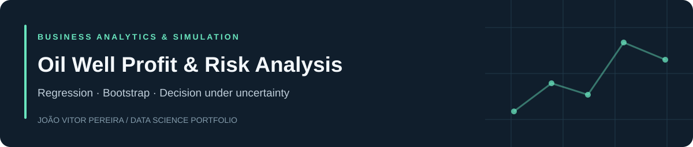

[English](README.md) · **Português** · [Portfólio](https://github.com/joaovspereira)

# Oil Well Profit & Risk Analysis

## Problema e objetivo

Selecionar uma região de exploração com risco simulado de prejuízo inferior a 2,5%.

## Resultados documentados

Região 1: lucro médio simulado de US$ 4,61 milhões e risco de prejuízo de 0,7%. Os números substituem US$ 5,18 milhões e 0,3%.

## Método

Regressão por região, seleção de 200 poços entre 500 locais avaliados e bootstrap para estimar lucro e risco.

## Tecnologias

Python · pandas · NumPy · scikit-learn · bootstrap

## Evidências e execução

- [Notebook completo](notebooks/oil_well_profit_risk_analysis.ipynb)
- [Arquivos de dados necessários](data/README.md)
- [Dependências](requirements.txt)
- [Instruções de instalação](README.md#run-locally)

## Escopo e limitações

Notebook reexecutado em 15/09/2026 após correção do alinhamento de índices duplicados. Simulação condicionada à amostra, ao modelo, ao orçamento e à receita unitária; não representa retorno financeiro realizado. Identificadores repetidos requerem investigação. Consulte também [VALIDATION.md](VALIDATION.md).

Projeto educacional desenvolvido no Data Science Bootcamp da TripleTen. A revisão de publicação dos projetos, exceto a reexecução documentada do petróleo, verificou estrutura e sintaxe sem repetir o treinamento completo. Os datasets não são redistribuídos.

[João Vitor Pereira](https://github.com/joaovspereira) · [Contato](mailto:joaovitorsouza20pereira@gmail.com)
